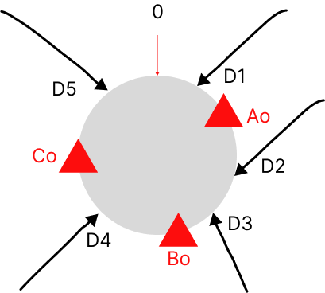
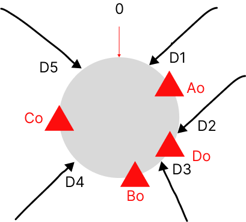

在分布式系统中，为了提高系统的可用性，我们往往采用集群的方式部署服务。既然是集群部署，集群的扩缩容是无法避免的。

在缓存场景中，我们希望同一个用户多次请求都落在同一个服务节点已提高缓存的命中率。在分布式存储中，我们希望对同一个数据的读写都落在同个存储节点以保证数据的正确读写。

如何解决上述问题呢？

## 传统哈希算法的困境

传统的哈希算法，可以根据哈希算法计算得到的值对集群节点数取模得出的值，决定应该选择哪个节点。

我们假设当前集群有A（哈希取模为0）/ B（哈希取模为1）/ C（哈希取模为2）三个节点，哈希函数为h。有三条数据，id1，id2，id=3。

```shell
h(id1) % 3 = 99 % 3 = 0（落在A节点）

h(id2) % 3 =100 % 3 = 1（落在B节点）

h(id3) % 3 = 101 % 3 = 2（落在C节点）
```

但是传统的哈希算法无法很好应对服务扩缩容后节点的变更带来大量数据迁移问题。如果集群扩容新增一个D节点，那么重新计算后的数据：

```shell
h(id1) % 4 = 99 % 4 = 3（落在D节点，原来在A节点）

h(id2) % 4 =100 % 4 = 0（落在A节点，原来在B节点）

h(id3) % 4 = 101 % 4 = 1（落在B节点，原来在C节点）
```

这样集群新增一个节点后，所有的数据经过哈希计算后都不在原来的节点了。如果是缩容减少一个节点，也会导致数据失效，具体情况你可自行计算。

也就是说使用传统的哈希算法做数据分片，无法高效应对集群的扩缩容。这时候**一致性哈希算法**可以高效解决集群扩缩容带来的数据失效问题。


## 一致哈希算法破局之道

维基百科对[一致性哈希](https://zh.wikipedia.org/wiki/%E4%B8%80%E8%87%B4%E5%93%88%E5%B8%8C)的定义：

>一致哈希是一种特殊的哈希算法。在使用一致哈希算法后，哈希表槽位数（大小）的改变平均只需要对K/n 个关键字重新映射，其中K是关键字的数量，n是槽位数量。

**比如我们集群有A/B/C三个节点，那么n=3；有100条数据，那么K=100。如果扩容一个节点，n=4，K/n = 100/4 = 25，也就是说只需要对25条数据重新映射即可。在传统哈希算法中往往就要全部映射。**

所以你看，传统哈希算法影响100条数据，需要对100条数据进行迁移。一致哈希算法只影响25条数据，只需要迁移25条数据。一致哈希算法应对集群扩缩容的效率更高。

### 传统哈希算法和一致哈希算法异同点


| 算法实现 | 相同点 | 不同点 |
|------|-----|-----|
|   传统哈希算法   |  有取模操作   |  对集群节点数取模   |
| 一致哈希算法 | 有取模操作 | 对固定数值取模，一般是的2的N次幂|

比如一致哈希对2^32取模。

### 一致哈希算法寻址原理

假设集群中有A/B/C三个节点，一致哈希算法为ch，对2^32取模。我们假设三个节点计算出来的值为：

```shell
ch(A) = Ao
ch(B) = Bo
ch(C) = Co
```
A/B/C经过一致哈希算法计算后值分别为Ao/Bo/Co。假设有五条数据，通过一致哈希算法计算后值分别为D1～5。它们在哈希环上的分布位置如下图：


数据经过一致哈希算法计算后，按照顺时针方向找到第一个节点。所以最终数据D1/D5落在节点A，数据D2/D3落在节点B，数据D4落在节点C。

假设集群扩容一个节点D后，经过计算D分布位置为Do，如下图：


这样最终需要发送变化的数据只有D2落在节点D，所以只需要把数据D2从节点B迁移到节点D即可。
K/n = 5/4 = 1.25，实际变更数据也只有一条。到这里，细心的你会发现如果Ao和Do之间刚好分布了很多数据，需要迁移的就很多了。

其实我们上面图中举的例子比较简单，K/n是一个在大量数据下的一个期望值，并非稳定的实际值。我们图中的例子给出的节点在哈希环上的分布也不均匀的。为了保证数据尽可能均匀，实际上我们还需要引入**虚拟节点**。

所谓虚拟节点，就是我们设置一些逻辑的节点，但是这些逻辑上的节点都映射到某个实际的节点。如下图：


这样如果我们的虚拟节点足够多，我们就能做到让集群的节点均匀持有虚拟节点。这样就保证了每个节点的数据就比较均匀。这样后续集群扩缩容后就可以保证数据迁移量基本保持在K/n附近。

### 一致性哈希算法使用场景

一致哈希算法一般用于分布式存储（比如Redis的分片模式）、服务的一致哈希路由寻址（比如本地缓存/有状态的请求）等。

## 附录

>Go官方也给出一个Go语言的一致哈希实现
[https://github.com/golang/groupcache/tree/master/consistenthash](https://github.com/golang/groupcache/tree/master/consistenthash)
